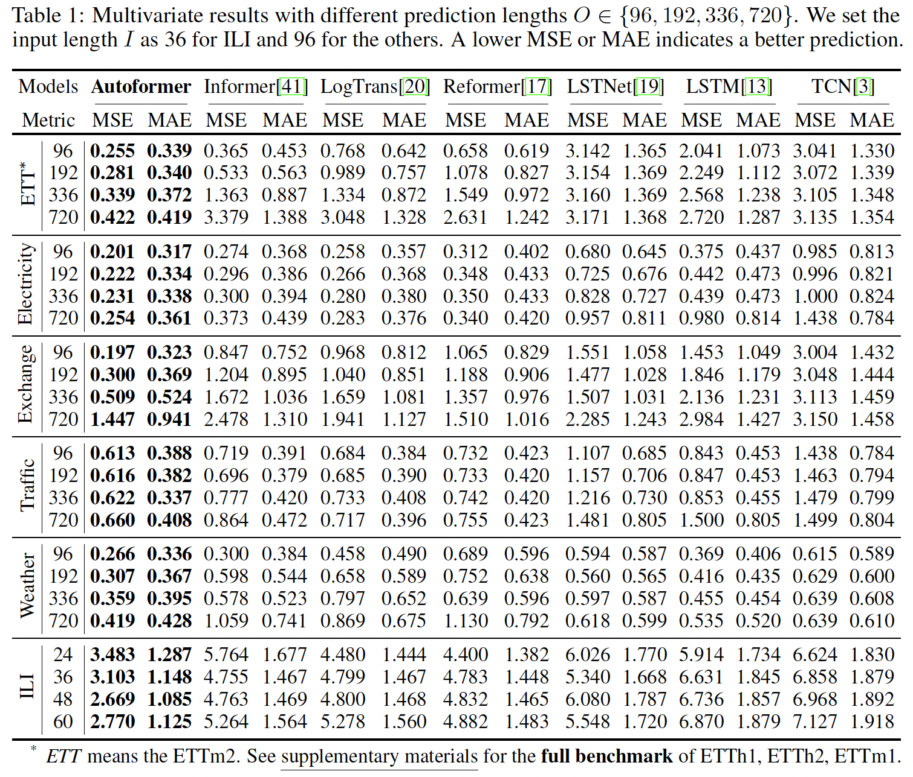

# TsFormer
TsFormer is a toolbox that implement transformer models on Time series data

## Todo

1. data preprocess
- gefcom2014
- uci
- ETT

2. dataloader

- dataloaders

3. models

- rnn
- lstm
- GRU
- ESN
- CNN
- TCN
- transformer
- informer
- autoformer

4. TODO
- [Spacetimeformer](https://github.com/QData/spacetimeformer)
- [SCINet](https://github.com/cure-lab/SCINet)
- [Deep learning for time series forecasting](https://github.com/AIStream-Peelout/flow-forecast)
- [PyTorch Forecasting](https://github.com/jdb78/pytorch-forecasting)
- [tsai](https://github.com/timeseriesAI/tsai)

5. train and evaluate

